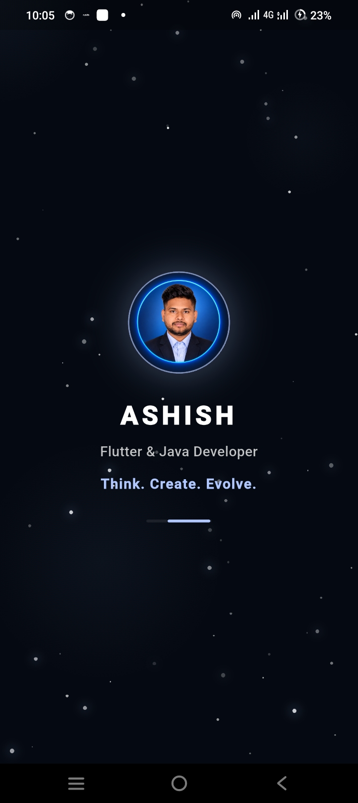
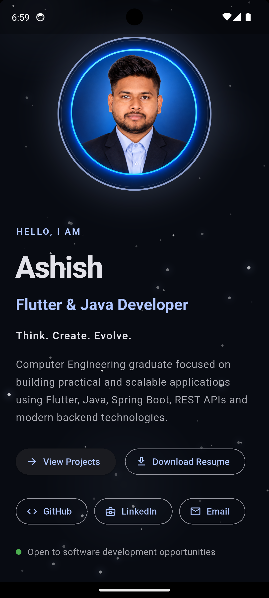
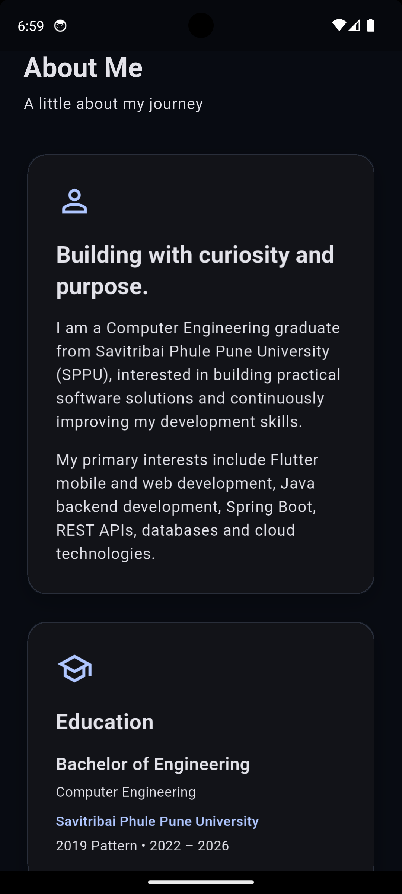
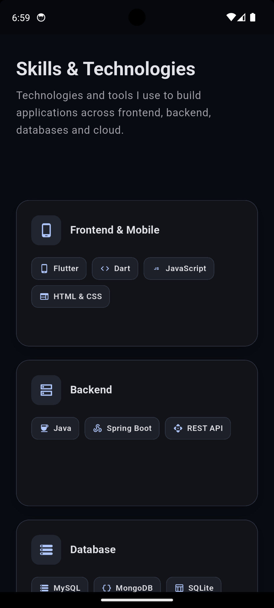
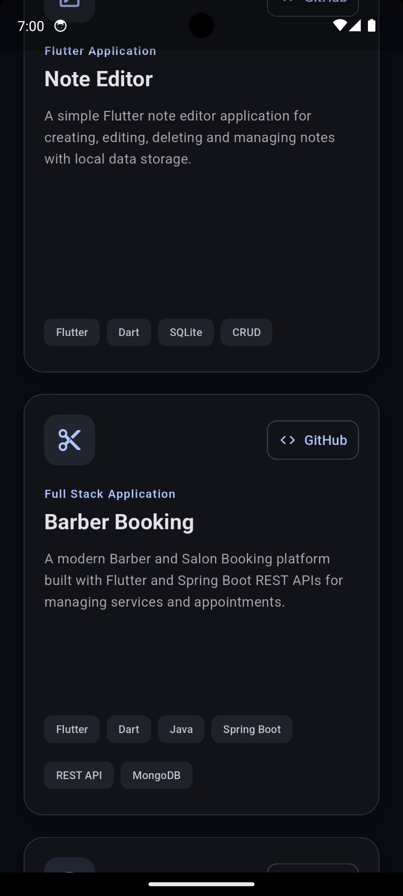

<div align="center">

  # 🚀 Ashish Gaikwad — Full Stack Developer Portfolio

  <p align="center">
    <b>Cross-Platform Mobile & Web Specialist | Flutter • Java • Spring Boot • REST APIs • AWS • Docker</b>
  </p>

  <p align="center">
    <i>A high-performance, responsive developer portfolio engineered with Flutter Web & Mobile to showcase software engineering expertise, full-stack enterprise projects, professional experience, and academic milestones.</i>
  </p>

  <br />

  <!-- BADGES SECTION -->
  <a href="https://linkedin.com/in/ashish9561/">
    
  </a>
  <a href="https://github.com/Ashish956175">
    
  </a>
  <a href="mailto:ashishgaikwad9561@gmail.com">
    
  </a>
  <a href="https://github.com/Ashish956175/flutter-java-developer-portfolio">
    
  </a>

  <br /><br />

  <!-- QUICK ACTION BUTTONS -->
  <a href="https://dddq8obusht4f.cloudfront.net">
    
  </a>
  <a href="mailto:ashishgaikwad9561@gmail.com?subject=Software%20Developer%20Hiring%20Opportunity">
    
  </a>
  <a href="https://github.com/Ashish956175/flutter-java-developer-portfolio/raw/main/assets/resume/Ashish_Resume.pdf">
    
  </a>

</div>

---

## 🌐 Live Demo

🚀 **Live Portfolio:** https://dddq8obusht4f.cloudfront.net

Deployed using:
- Flutter Web
- Amazon S3
- Amazon CloudFront
- HTTPS

---

## 🌟 Executive Summary & Value Proposition

Hello recruiters, hiring managers, and engineers! 👋 

I am **Ashish Gaikwad**, a dedicated **Full Stack Developer** and **Computer Engineering Graduate** from Savitribai Phule Pune University (SPPU). 

With hands-on experience as an **Associate Software Engineer at ThynkTech India Pvt. Ltd.**, I specialize in crafting scalable end-to-end applications:
- **Frontend & Mobile Excellence:** Building pixel-perfect, responsive UI/UX across Web, iOS, and Android using **Flutter & Dart**.
- **Backend & Cloud Architecture:** Engineering robust, secure RESTful microservices with **Java & Spring Boot**, integrated with relational (**MySQL, SQLite**) and NoSQL (**MongoDB**) databases.
- **Modern DevOps Practices:** Packaging services with **Docker** and deploying scalable applications on **AWS**.

> 💡 **Why Hire Me?** I bring a strong foundation in Data Structures & Algorithms (DSA), clean architecture patterns, proactive problem-solving, and a passionate commitment to software development excellence.

---

## 📸 Portfolio Preview & Screenshots

Here is a visual tour of the responsive Flutter Portfolio across **Desktop** and **Mobile** viewports, featuring the newly added **Animated Splash / Flash Screen**.

### 🖥️ Desktop / Web Experience

| Section | Preview Screenshot |
| :--- | :--- |
| **Hero & Welcome (Dark Mode)**<br>*(Interactive developer identity card & quick CTA buttons)* |  |
| **Hero & Welcome (Light Mode)**<br>*(Clean light theme with responsive Developer ID card)* |  |
| **About Me & Journey**<br>*(Engineering background, vision, and core philosophy)* |  |
| **Work Experience Card**<br>*(Associate Software Engineer @ ThynkTech India)* |  |
| **Featured Projects Grid**<br>*(Full-stack healthcare, booking systems, & native apps)* |  |
| **Technical Skills Matrix**<br>*(Categorized badges: Mobile, Backend, DB, Cloud, Tools)* |  |
| **Certifications & Internships**<br>*(ServiceNow, Java Full Stack, ChatGPT Prompt Eng.)* |  |
| **Contact & Social Connect**<br>*(Direct email launcher, GitHub, and LinkedIn links)* |  |

---

### 📱 Mobile Responsive Experience & Splash Screen

| Splash / Flash Screen | Mobile Hero & Intro | Mobile Experience | Mobile Projects & Skills | Mobile Contact & Connect |
| :---: | :---: | :---: | :---: | :---: |
|  |  |  |  |  |

---

## 🛠️ Tech Stack & Core Competencies

<div align="center">

| Domain | Technologies & Frameworks |
| :--- | :--- |
| **Mobile & Frontend** | `Flutter` `Dart` `JavaScript` `HTML5` `CSS3` `Material Design 3` |
| **Backend Engineering** | `Java` `Spring Boot` `REST APIs` `Spring Data JPA` `OOP` |
| **Database Management** | `MySQL` `MongoDB` `SQLite` `Shared Preferences` |
| **Cloud & DevOps** | `AWS` `Docker` `Git` `GitHub` |
| **Core Software Principles**| `Data Structures & Algorithms (DSA)` `Clean Architecture` `Agile/Scrum` |

</div>

```
                      +----------------------------------+
                      |       FLUTTER / DART FRONTEND    |
                      |  (Web, Android, iOS Responsive)  |
                      +----------------+-----------------+
                                       |
                                HTTP / REST API
                                       |
                      +----------------v-----------------+
                      |     JAVA & SPRING BOOT BACKEND   |
                      |  (Microservices & Business Logic)|
                      +----------------+-----------------+
                                       |
                    +------------------+------------------+
                    |                                     |
          +---------v----------+                +---------v----------+
          |    MYSQL / SQL     |                |      MONGODB       |
          | (Relational Data)  |                |  (Document Store)  |
          +--------------------+                +--------------------+
```

---

## 💼 Professional Experience

### **Associate Software Engineer** — *ThynkTech India Pvt. Ltd.*
*📍 Pune, Maharashtra, India*

- **Cross-Platform Mobile Development:** Engineered modular and responsive mobile user interfaces using **Flutter** and **Dart**.
- **RESTful API Integration:** Built and consumed seamless REST endpoints connecting frontend clients with high-throughput backend services.
- **Backend Architecture:** Developed enterprise backend services utilizing **Java** and **Spring Boot**.
- **Database Management:** Managed SQL schema designs and queries in **MySQL** and document stores in **MongoDB**.
- **Containerization & Deployment:** Utilized **Docker** to build reproducible container environments for streamlined staging and deployment.

---

## 📁 Featured Projects Showcase

### 1. 🏥 [MedicarePlus](https://github.com/Ashish956175/MedicarePlus)
- **Category:** Full Stack Healthcare Application
- **Tech Stack:** `Flutter` `Java` `Spring Boot` `MySQL` `REST API`
- **Key Features:** End-to-end appointment scheduling system for patients, doctors, and healthcare admins with role-based authentication and database integration.

### 2. 💈 [BarberBooking](https://github.com/Ashish956175/BarberBooking)
- **Category:** Full Stack Salon Booking Platform
- **Tech Stack:** `Flutter` `Java` `Spring Boot` `MongoDB` `REST API`
- **Key Features:** Service discovery, appointment calendar scheduling, and backend slot management powered by Spring Boot REST services.

### 3. 📝 [Note Editor](https://github.com/Ashish956175/Note_Editor_App_Flutter)
- **Category:** Flutter Mobile Application
- **Tech Stack:** `Flutter` `Dart` `SQLite` `CRUD`
- **Key Features:** Offline-first note-taking application featuring rich text operations, search capabilities, and local SQLite data persistence.

### 4. 🏦 [Bank Management System](https://github.com/Ashish956175/Bank_Management_System)
- **Category:** Java Banking Simulator
- **Tech Stack:** `Java` `OOP` `Banking Domain`
- **Key Features:** Command-line core banking execution demonstrating Object-Oriented Programming (OOP), transaction tracking, account balance calculations, and validation logic.

### 5. 🔐 [Shared Preferences Flutter](https://github.com/Ashish956175/Shared_Preferences_Flutter)
- **Category:** Flutter Utility App
- **Tech Stack:** `Flutter` `Dart` `Shared Preferences`
- **Key Features:** Lightweight application demonstrating state persistence, local session storage, and persistent login flow across app restarts.

---

## 🎓 Education & Academic Background

- 🎓 **Bachelor of Engineering (B.E.) in Computer Engineering**  
  *Savitribai Phule Pune University (SPPU)* | `2022 – 2026` | **CGPA: 6.58**
- 📚 **Higher Secondary Certificate (HSC)** | `2022` | **57.80%**
- 📖 **Secondary School Certificate (SSC)** | `2020` | **80.60%**

---

## 📜 Certifications & Internships

- ☁️ **ServiceNow Virtual Internship Program** — *SmartBridge • AICTE • ServiceNow*
- ☕ **Java Full Stack with React JS & AI** — *Professional Certification*
- 🤖 **Prompt Engineering for ChatGPT** — *AI Integration Specialist Certification*
- 🗄️ **Java & SQL Development Program** — *EXL & TNS India Foundation*

---

## 📂 Project Architecture

```
flutter-java-developer-portfolio/
├── assets/
│   ├── icon/                 # Application icons & branding
│   ├── images/               # Profile picture & media assets
│   └── resume/               # Official downloadable PDF resume
├── docs/                     # Showcase screenshots for README
│   ├── browser_screens/      # Desktop viewport screenshots
│   └── mobile_screens/       # Mobile viewport screenshots
├── lib/
│   ├── core/                 # App configuration & themes
│   ├── models/               # Data structures & models
│   ├── screens/              # Portfolio views & animated splash screen
│   │   ├── portfolio_home.dart
│   │   └── splash_screen.dart
│   ├── sections/             # Modular section components
│   │   ├── hero_section.dart
│   │   ├── about_section.dart
│   │   ├── experience_section.dart
│   │   ├── projects_section.dart
│   │   ├── skills_section.dart
│   │   ├── certifications_section.dart
│   │   ├── education_section.dart
│   │   └── contact_section.dart
│   ├── utils/                # Cross-platform URL & email launcher helpers
│   │   └── link_launcher.dart
│   └── widgets/              # Reusable UI widgets & animations
├── pubspec.yaml              # Flutter dependencies & assets metadata
└── README.md                 # Professional portfolio README
```

---

## 💻 Local Setup & Execution Guide

To run this portfolio locally on your machine:

1. **Clone the repository:**
   ```bash
   git clone https://github.com/Ashish956175/flutter-java-developer-portfolio.git
   cd flutter-java-developer-portfolio
   ```

2. **Install dependencies:**
   ```bash
   flutter pub get
   ```

3. **Run on Chrome (Web):**
   ```bash
   flutter run -d chrome
   ```

4. **Build for Web Production:**
   ```bash
   flutter build web --release
   ```

---

## 📫 Let's Connect & Build Together!

I am actively looking for **Full Stack Developer**, **Flutter Developer**, and **Java / Spring Boot Software Engineer** roles.

- 📧 **Email:** [ashishgaikwad9561@gmail.com](mailto:ashishgaikwad9561@gmail.com)
- 💼 **LinkedIn:** [linkedin.com/in/ashish9561](https://linkedin.com/in/ashish9561/)
- 🐙 **GitHub:** [github.com/Ashish956175](https://github.com/Ashish956175)

---

<div align="center">
  <sub>Designed & Developed with ❤️ by <b>Ashish Gaikwad</b> using Flutter & Dart.</sub>
</div>
